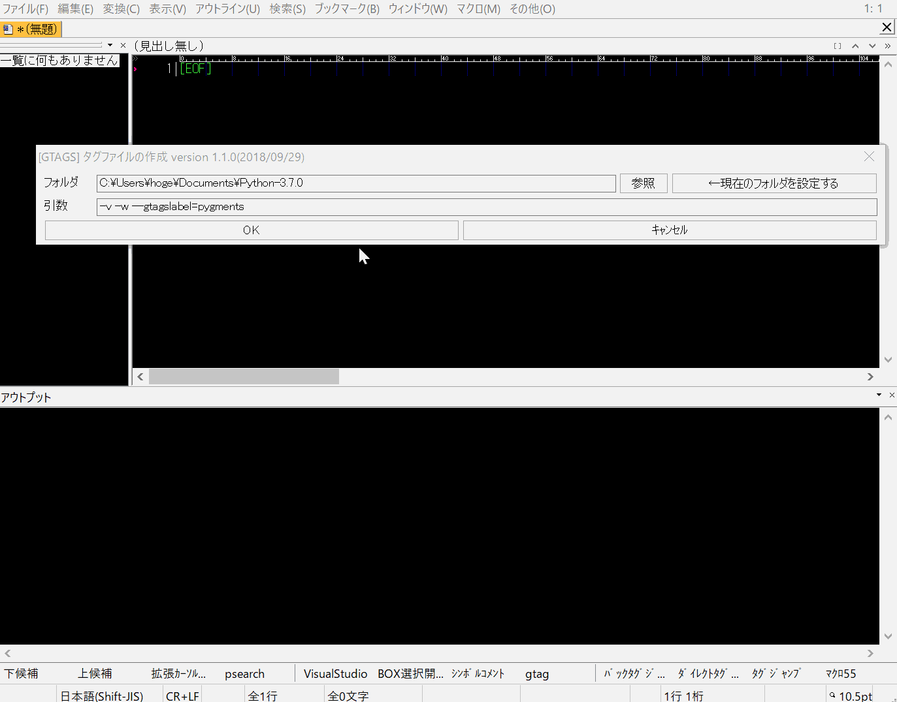

# GNU GLOBAL を秀丸エディタで使用するためのマクロ


[](https://opensource.org/licenses/MIT)

# このマクロの特徴

このマクロは[GNU GLOBAL(gtags)](https://www.tamacom.com/global-j.html)を使用して「関数・変数が呼ばれているソースコード位置」を秀丸エディタで一覧表示することが出来ます。

# 動作イメージ
- カーソルを調べたい単語の上に置いてから`gtags_jump.mac`マクロを実行するとメニューが開きます。
- メニューからgtagsの動作を選択します。
- 検索結果は秀丸のgrepと同じ形式で出力するので、秀丸エディタの標準機能を使ってタグジャンプが可能です。

## gtags_jump.mac（タグジャンプを行う本体マクロ）


## gtags_wrapper.mac (タグファイル生成をサポートするおまけマクロ)




# マクロの導入方法

このようにコピーして下さい。

	└─hidemaru-macrodir
	    └─gtags_for_hidemaru
	        ├─doc
	        ├─images
	        └─macro
	            ├─gtags_config.ini
	            ├─gtags_jump.mac
	            └─gtags_wrapper.mac
	
- gtags_jump.mac マクロに任意のショートカットキーを割り当ててご使用下さい。
- gtags_wrapper.mac は*おまけマクロ*です、後述の説明を読んで必要な方だけご使用下さい。

## ファイル構成

|ファイル名|説明|
|:---|:---|
|macro/gtags_jump.mac|タグジャンプを行うマクロ（マクロ本体）|
|macro/gtags_wrapper.mac|タグファイルの作成を補助するマクロ（おまけマクロ）|
|macro/gtags_config.ini|設定ファイル|
|doc/readme.pdf|使い方の詳細です|

# カスタマイズ

同梱の`gtags_config.ini`ファイルを編集することで、各自の環境に応じたカスタマイズが可能です。

## 必須のカスタマイズ

各自の環境に合わせてGNU GLOBALの実行ファイルのパスを設定して下さい。
```
global=C:\glo593wb\bin\global.exe
gtags=C:\glo593wb\bin\gtags.exe
```
詳細はファイル中のコメントを参照して下さい。

## タグファイルを複数フォルダから検索する設定

gtags_config.iniの`Searchセクション`を編集してください、開発中のアプリとライブラリが別フォルダ・別ドライブにあるときに使うと便利です。


# 動作環境

- 秀丸エディタ ver8以降
- [田楽DLL](http://www.ceres.dti.ne.jp/~sugiura/)
- [GNU GLOBAL 6.6.2](https://www.tamacom.com/global-j.html)

# 更新履歴

## 2019/02/08 ver 1.3.0
- [田楽DLL](http://www.ceres.dti.ne.jp/~sugiura/)を`マクロフォルダ・秀丸エディタフォルダ`の２箇所から読み込むようにしました。田楽DLLの読み込みエラーが発生している場合はこのバージョンを試して下さい。

## 2018/10/07 ver 1.2.0

gtags_wrapper.macの改良
- gtagsのコンバート経過をアウトプット枠に出力するようにしました。
- タグファイル生成中でも秀丸マクロを実行できるようにしました。

## 2018/09/28 ver 1.1.0

gtags_wrapper.macの改良
- ダイアログに”現在のフォルダを設定”するボタンを追加した。
- ダイアログのタイトルにバージョン番号を追加した。

## 2011/05/21 ver 1.0.0

公開

# バージョン番号のルール

バージョン番号の表記方法

バージョン番号は version 1.2.3 のように表記され、それぞれ major.minor.revision を表します。

|番号|説明|
|:--:|:--:|
|major|互換性が失われる大きな変更を表します|
|minor|機能追加のように互換性のある更新を表します|
|revision|バグ修正のように機能そのものに変化が無い軽微な更新を表します|

# ダウンロード

こちらから動作確認済みのアーカイブをダウンロードして下さい。<br>
https://github.com/ohtorii/gtags_for_hidemaru/releases

*注意*
masterブランチを取得しても多分動作しないです。<br>
一人で開発しているのでブランチを作らずに気楽に開発してます。（仕事じゃないしね😉）

# トラブル事例

## マクロを実行しても関数・変数が呼ばれているソースコード位置が表示されない
- [GNU GLOBAL(gtags)](https://www.tamacom.com/global-j.html)がコマンドプロンプトで動作するかどうかを確認して原因の切り分けを行って下さい。
- コマンドプロンプトで期待したとおりに動作するように設定を済ませてからこのマクロを使用して下さい、。


# 連絡先
<http://d.hatena.ne.jp/ohtorii/> <br>
<https://twitter.com/ohtorii> <br>
<https://github.com/ohtorii/gtags_for_hidemaru>
