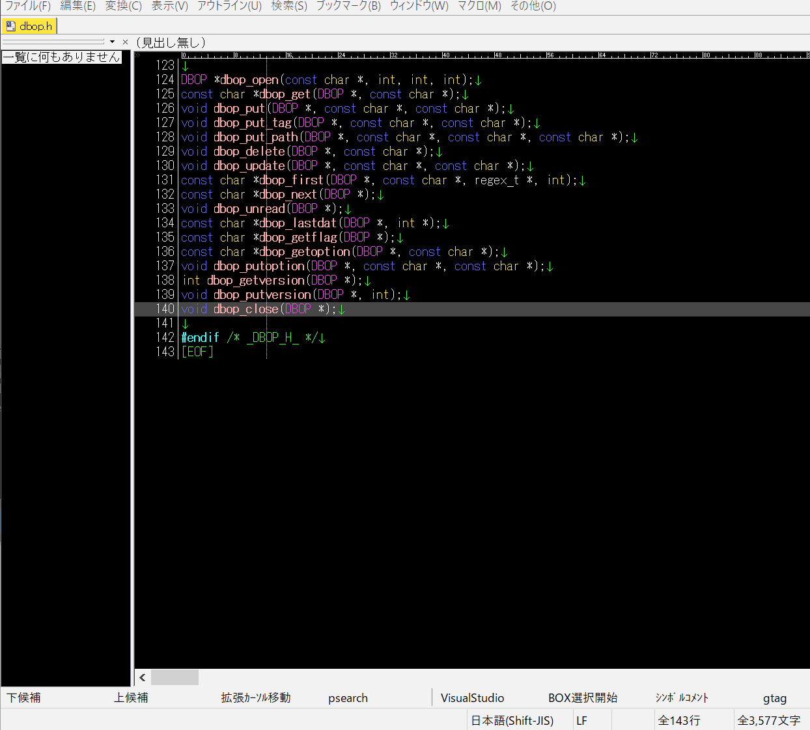
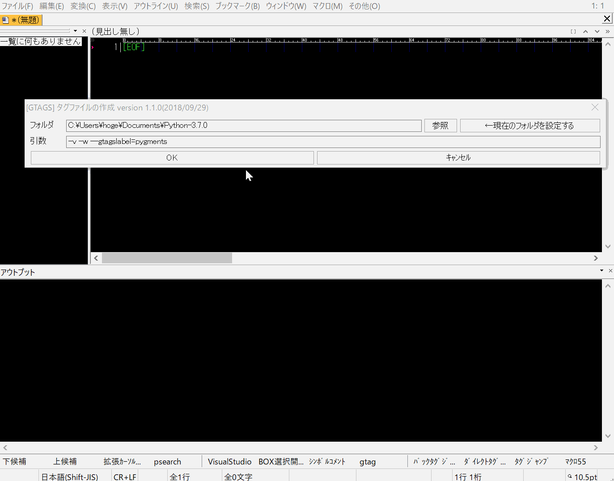

GNU GLOBAL を秀丸エディタで使用するためのマクロ
=============
### gtags_jump.mac（タグジャンプを行う本体マクロ）<br>


### gtags_wrapper.mac (タグファイル生成をサポートするおまけマクロ)<br>


# このマクロの特徴
gtagsの対応言語で「関数・変数が呼ばれているソースコード位置」を一覧表示することが出来ます。<br>
`定義されている位置`ではなく`呼ばれている位置`です。

|プログラム|機能|
|:---|:---|
|GNU GLOBAL|関数が呼ばれている位置|
|ctags|関数が定義されている位置|

### 動作イメージ
- カーソルを調べたい単語の上に置いてから`gtags_jump.mac`マクロを実行するとメニューが開きます。
- メニューからgtagsの動作を選択します。
- 検索結果は秀丸のgrepと同じ形式で出力するので、秀丸エディタの標準機能を使ってタグジャンプが可能です。

# マクロの導入方法
- macroフォルダ中の全ファイルを秀丸エディタのマクロファイル用のフォルダにコピーしてください。
- gtags_jump.mac マクロにキーを割り当ててご使用下さい。

# カスタマイズ
同梱の`gtags_config.ini`ファイルを編集することで、各自の環境に応じたカスタマイズが可能です。

### 必須のカスタマイズ
各自の環境に合わせてGNU GLOBALの実行ファイルのパスを設定して下さい。
```
global=C:\glo593wb\bin\global.exe
gtags=C:\glo593wb\bin\gtags.exe
```
詳細はファイル中のコメントを参照して下さい。

### タグファイルを複数のフォルダから検索したい場合は？
gtags_config.iniの`Searchセクション`を編集してください、開発中のアプリとライブラリが別フォルダ・別ドライブにあるときに使うと便利です。

# ファイル構成
|ファイル名|説明|
|:---|:---|
|doc/readme.pdf|使い方の詳細です|
|macro/gtags_jump.mac|タグジャンプを行うマクロ（マクロ本体）|
|macro/gtags_wrapper.mac|タグファイルの作成を補助するマクロ（おまけマクロ）|
|macro/gtags_config.ini|設定ファイル|

# 動作環境
- 秀丸エディタ ver8以降
- でんがくDLL

# 更新履歴
### 2018/10/07 ver 1.2.0
gtags_wrapper.macの改良
- gtagsのコンバート経過をアウトプット枠に出力するようにしました。
- タグファイル生成中でも秀丸マクロを実行できるようにしました。
### 2018/09/28 ver 1.1.0
gtags_wrapper.macの改良
- ダイアログに”現在のフォルダを設定”するボタンを追加した。
- ダイアログのタイトルにバージョン番号を追加した。
### 2011/05/21 ver 1.0.0
公開
  
# 連絡先
<http://d.hatena.ne.jp/ohtorii/> <br>
<https://twitter.com/ohtorii>
